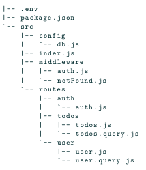

Epytodo
=======

## Description
Epytodo is a first year project at Epitech in which we have to create our own web API. This API aims to manage a database to store users and tasks that they can create, modify and delete. This method of tasks is very common in the professional world in order to organise on a solo or team project.

Here is the recommended repository's structure used for this project (without bonuses) :



## Install and Run the project
### Requirements
> - [NodeJS](https://nodejs.org/en/download/package-manager/)
> - [MySQL](https://dev.mysql.com/doc/mysql-installation-excerpt/5.7/en/) or [MariaDB](https://www.mariadbtutorial.com/getting-started/install-mariadb/)
> - [PhpMyAdmin](https://docs.phpmyadmin.net/en/latest/setup.html) (optional, if you want to view your database)

---

To use the EpyTodo, you need to install the dependencies and launch it locally on your PC.

*Clone the project:*
```
git clone git@github.com:ZerLock/Epytodo.git

cd EpyTodo
```

*Install all dependencies:*
```
npm install
```

*Create the database:*
```
cat epytodo.sql | mysql -u root -p
```

*Run the project:*
```
npm start
```

Enjoy !

---

## Specifications
- In the environment variables, we use **MYSQL_PASSWORD** and not **MYSQL_ROOT_PASSWORD**. We wanted to do it as if it were a customer service. So each project has a different login which is not **ROOT** !

- A regex.js file has been added in /src/config allowing us to have and use the regex globally in the project!

- If the user does not specify the **PORT** in the environment variables or the port is already taken. The application will launch on port 3000.

- The **routes** are named like those in the table on page 4 of the 2026 promo topic.
 
## EpyTodo instructions routes
In order to take full advantage of this project. It is important to know each of the routes and their use within the API.

|Route              |Method|Protected|Description|
|:------------------|:-----|:--------|:----------|
|/register          |POST  |NO       |Register a new user|
|/login             |POST  |NO       |Connect a user|
|/user              |GET   |YES      |View all user information|
|/user/todos        |GET   |YES      |View all user tasks|
|/users/:id or :email|GET   |YES      |View user information|
|/users/:id          |PUT   |YES      |Update user information|
|/users/:id          |DELETE|YES      |Delete user|
|/todos              |GET   |YES      |View all the todo|
|/todos/:id          |GET   |YES      |View the todo|
|/todos              |POST  |YES      |Create a todo|
|/todos/:id          |PUT   |YES      |Update a todo|
|/todos/:id          |DELETE|YES      |Delete a todo|
\* To access the protected routes, you need a token that can be retrieved via the ``/register`` and ``/login`` routes.<br>
\** todo = task

## Results
|Label|Mark|
|:---:|:--:|
|Preliminaries|2/2|
|Web Server|5/5|
|Routes (does it exists)|3/3|
|Routes (Is it well done)|3/3|
|Password|1/1|
|Token|3/3|
|SQL DB|5/5|

## Bonuses

We have several bonuses like, a **Postman collection**, an accessible **frontend** (on a version dating from 3 days before the rendering of the project) on [epuytodo.tk](https://epuytodo.tk) (code available on [github.com/ZerLock/epytodo_front](https://github.com/ZerLock/epytodo_front) )

---

## Developers
- [Léo Dubosclard](https://www.github.com/ZerLock)
- [Baptiste Leroyer](https://github.com/ZiplEix)
